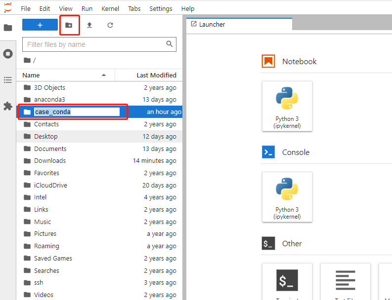
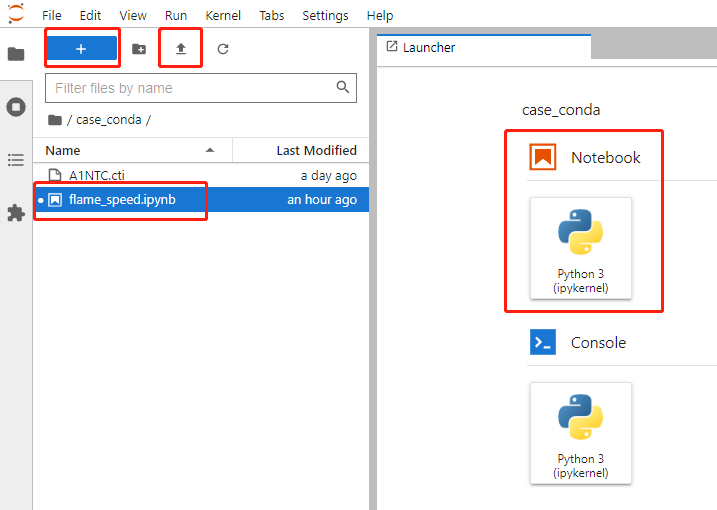

计算航空煤油掺混氢气的层流火焰速度
===================================

我们利用Cantera软件计算航空煤油掺混氢气的一维预混火焰，得到层流火焰速度。
	
燃烧化学反应机理
*****************

燃烧是一种放热发光的化学反应。反应机理是化学中用来描述某一化学变化所经由的全部基元反应，就是把一个复杂反应分解成若干个基元反应，然后按照一定规律组合起来，从而达到阐述复杂反应的内在联系，以及总反应与基元反应内在联系之目的。机理详细描述了每一步转化的过程，包括过渡态的形成，键的断裂和生成，以及各步的相对速率大小等。

为了计算航空煤油掺混氢气的一维预混层流火焰，我们需要描述其燃烧过程的化学反应机理。反应机理并不是唯一的，对于同一个燃烧过程也可以选用不同的反应机理来描述。通常情况下，越复杂的反应机理精确度越高，但相应的计算量也更大。这里我们选用斯坦福大学开发的 `HyChem反应机理 <https://web.stanford.edu/group/haiwanglab/HyChem/pages/Home.html>`_ 来描述航空煤油掺混氢气的燃烧。

右键点击 `这个链接 <https://web.stanford.edu/group/haiwanglab/HyChem/download/cantera/A1NTC.cti>`_ 选择 **链接另存为** 下载 **A1NTC.cti** 机理文件供后续使用。

计算层流火焰速度
*****************

我们打开JupyterLab网页，在菜单栏下方的快捷工具栏中点击 **New Folder** 按钮。为文件夹设定名称，例如 **case_conda** ：

双击新建的文件夹进入，在菜单栏下方的快捷工具栏中点击 **Upload Files** 按钮，选择我们刚刚下载好的 **A1NTC.cti** 机理文件上传。

.. Note::

	JupyterLab文件夹的位置就在 ``C:\Users\[你的Windows用户名]\case_conda\``

然后在菜单栏下方的快捷工具栏中点击 **New Launcher** 按钮。在右侧主窗口弹出的Launcher界面中点击Notebook下方的Python 3按钮。JupyterLab默认新建一个名为Untitled.ipynb文件，我们可以在左侧边栏右击或者按F2将这个文件重命名，比如命名为flame_speed.ipynb。

输入下列代码进行计算：

.. code-block::

	import cantera as ct
	
	# Simulation parameters
	p = 1.0*ct.one_atm  # pressure [Pa]
	Tin = 300.0  # unburned gas temperature [K]
	phi = 1.0  # equivalence ratio [-]
	H2_ratio = 0.2 # blending molar ratio of hydrogen [-]
	
	fuel = "POSF10264:"+str(1.0-H2_ratio)+",H2:"+str(H2_ratio)  # 燃料组分，POSF10264是航空煤油
	air = "O2:0.21,N2:0.79"
	
	width = 0.03  # m
	loglevel = 0  # amount of diagnostic output (0 to 8)
	
	# Solution object used to compute mixture properties, set to the state of the
	# upstream fuel-air mixture
	gas = ct.Solution('A1NTC.cti')
	gas.TP = Tin, p
	gas.set_equivalence_ratio(phi=phi, fuel=fuel, oxidizer=air)
	
	# Set up flame object
	f = ct.FreeFlame(gas, width=width)
	f.set_refine_criteria(ratio=3, slope=0.06, curve=0.12)
	#f.show_solution()
	
	# Solve with mixture-averaged transport model
	# f.transport_model = 'Mix'
	# Solve with multi-component transport properties
	f.transport_model = 'Multi'
	f.solve(loglevel=loglevel, auto=True)
	
	#f.show_solution()
	print('multicomponent flamespeed = {0:7f} m/s'.format(f.velocity[0]))
	try:
		f.write_hdf('adiabatic_flame.h5', group='multi',
					description='solution with multicomponent transport')
	except ImportError:
		f.save('adiabatic_flame.yaml', 'multi',
			'solution with multicomponent transport')
	
	# write the velocity, temperature, density, and mole fractions to a CSV file
	f.write_csv('adiabatic_flame.csv', quiet=False)

.. Warning::

	程序运行时会出现 ``CanteraWarning: NasaPoly2::validate:`` 的警告信息，我们可以忽略。最后运行结果是 ``multicomponent flamespeed = 0.359553 m/s  Solution saved to 'adiabatic_flame.csv'.`` 我们成功计算得到了层流火焰速度为0.359553 m/s。
	
.. Note::

	为了建立不同工况下混合燃料的层流火焰速度数据库，我们需要计算压力1-20个大气压（atm），温度300-600 K，当量比（equivalence ratio）0.5-1.5，掺氢比（H2_ratio）0-0.5范围内取值时的层流火焰速度。
	
	压力可取值 [1..2..3......19..20]，温度可取值 [300..325..350......575..600]，当量比可取值 [0.5..0.6..0.7......1.4..1.5]，掺氢比可取值 [0..0.1..0.2......0.4..0.5]。
	
	可以自己编写循环进行计算，并将结果保存到Python列表或者NumPy数组中。
