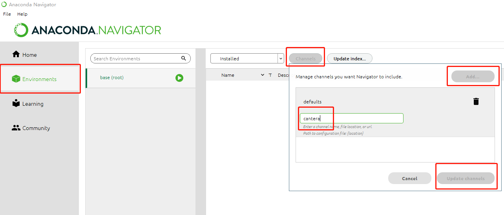

软件安装
========

本课题研究需要用到Cantera和Tensorflow这2个软件，同时需要使用Python语言编写程序。下面介绍软件安装步骤：

安装Anaconda（Python语言运行环境）
*********************************

`Anaconda <https://www.anaconda.com/>`_ 是一个开源的Python语言的发行版本，用于计算科学。安装该软件可为Cantera和Tensorflow提供所需的Python语言运行环境。

`点此链接下载 <https://repo.anaconda.com/archive/Anaconda3-2022.05-Windows-x86_64.exe>`_ 并安装Anaconda。

安装Cantera
***********

`Cantera <https://cantera.org/>`_ 是一个开源化学动力学软件，我们可以用它来模拟包括燃烧在内的化学反应过程。Anaconda软件默认没有提供Cantera的安装源，因此首先我们需要添加Cantera的安装源。

在开始菜单找到Anaconda Navigator打开，左侧边栏点击 **Environments** => **Channels** 按钮，在弹出的对话框中点击 **Add...** ，输入 **cantera** 后 **按回车键**，最后点击 **Update channels** 完成添加。

安装Tensorflow
**************
