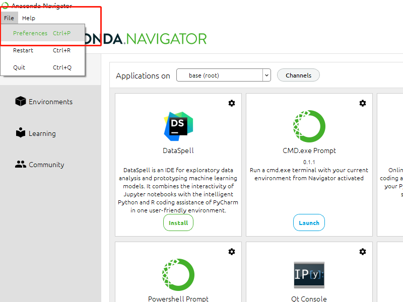
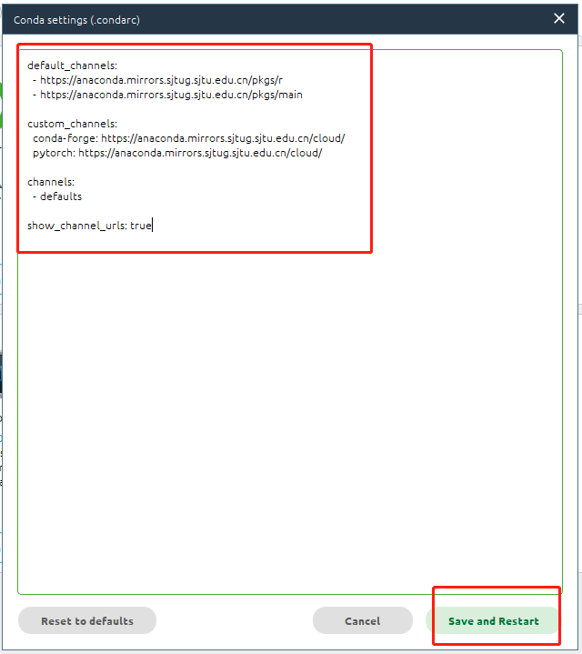

软件安装
========

本课题研究需要用到Cantera和Tensorflow这2个软件，同时需要使用Python语言编写程序。下面介绍软件安装步骤：

安装Anaconda（Python语言运行环境）
*********************************

`Anaconda <https://www.anaconda.com/>`_ 是一个开源的Python语言的发行版本，用于计算科学。安装该软件可为Cantera和Tensorflow提供所需的Python语言运行环境。

`点此链接下载 <https://repo.anaconda.com/archive/Anaconda3-2022.05-Windows-x86_64.exe>`_ 并安装Anaconda。

设置Anaconda
************

安装后在开始菜单找到Anaconda Navigator打开。首先，我们把软件的服务器地址改成国内的，这样后面连接下载程序包的速度更快。左上角点击 **File => Preferences** 打开软件设置界面：

打开后点击 **Configure Conda** ：

.. image:: images/channel_config_2.png
  
将原先的默认设置删除，然后复制下面的设置文本粘贴上去，这里我们采用了上海交通大学的服务器：

.. code-block::

  default_channels:
    - https://anaconda.mirrors.sjtug.sjtu.edu.cn/pkgs/r
    - https://anaconda.mirrors.sjtug.sjtu.edu.cn/pkgs/main
  
  custom_channels:
    conda-forge: https://anaconda.mirrors.sjtug.sjtu.edu.cn/cloud/
    pytorch: https://anaconda.mirrors.sjtug.sjtu.edu.cn/cloud/
  
  channels:
    - defaults
  
  show_channel_urls: true

点击 **Save and Restart** 完成服务器的设置：

安装Cantera
***********

安装Tensorflow
**************
