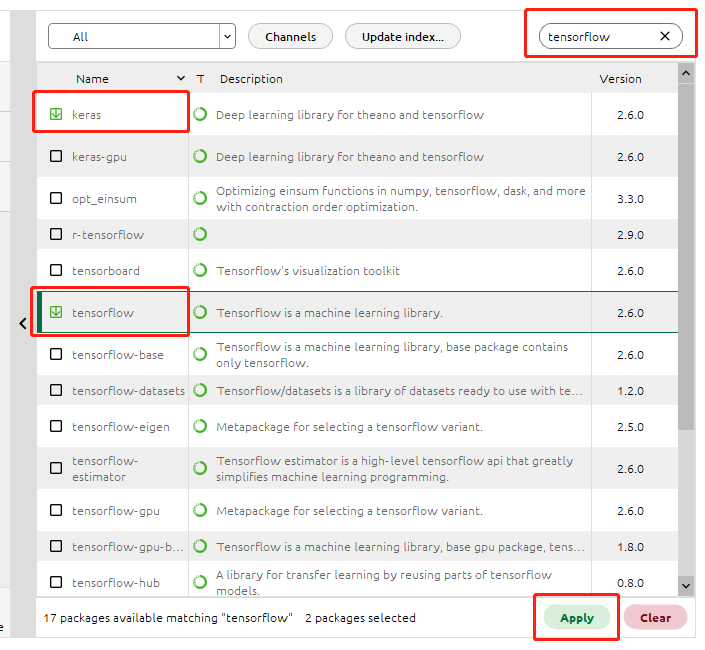

软件安装
========

本课题研究需要用到Cantera和Tensorflow这2个软件，同时需要使用Python语言编写程序。下面介绍软件安装步骤：

安装Anaconda（Python语言运行环境）
**********************************

`Anaconda <https://www.anaconda.com/>`_ 是一个开源的Python语言的发行版本，用于计算科学。安装该软件可为Cantera和Tensorflow提供所需的Python语言运行环境。

`点此链接下载 <https://repo.anaconda.com/archive/Anaconda3-2022.05-Windows-x86_64.exe>`_ 安装包，**双击.exe安装包** 即可安装Anaconda。

安装Cantera
***********

`Cantera <https://cantera.org/>`_ 是一个开源化学动力学软件，我们可以用它来模拟包括燃烧在内的化学反应过程。Anaconda软件默认没有提供Cantera的安装源，因此首先我们需要添加Cantera的安装源。

在开始菜单找到Anaconda Navigator打开，左侧边栏点击 **Environments** => **Channels** 按钮，在弹出的对话框中点击 **Add...** ，输入 **cantera** 后 **按回车键**，最后点击 **Update channels** 完成添加。

.. image:: images/install-cantera-1.png

接着，我们搜索Cantera软件并安装。点击 **Installed** 旁边的小箭头，切换为 **All** ，然后在右侧的搜索框中输入cantera。

.. image:: images/install-cantera-2.png

可以看到，我们已经搜索到了Cantera软件包，在它左侧的方框中打钩选中，然后点击右下角的 **Apply** 按钮。

.. image:: images/install-cantera-3.png

在弹出的对话框中点击 **Apply** ，完成安装。

.. image:: images/install-cantera-4.png

安装TensorFlow
**************

`TensorFlow <https://www.tensorflow.org/?hl=zh-cn>`_ 是Google开发的一个开源软件库，用于各种感知和语言理解任务的机器学习。Anaconda软件默认提供了TensorFlow的安装源，因此直接搜索安装即可。

搜索框中输入tensorflow，在下方出现的tensorflow软件包左侧打钩，然后点击右下角的 **Apply** 按钮。

在弹出的对话框中点击 **Apply** ，完成安装。由于TensorFlow软件包较大，下载安装根据网速可能需要较长时间，请耐心等待。