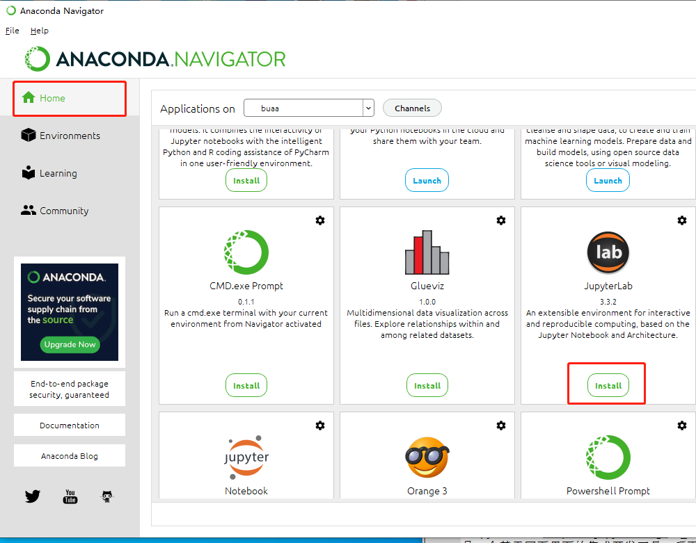
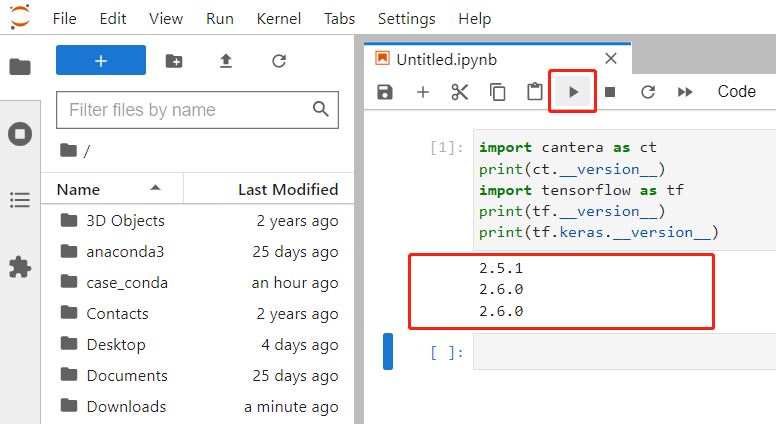

软件安装
========

本课题研究需要用到Cantera和Tensorflow这2个软件，同时需要使用Python语言编写程序。下面介绍软件安装步骤：

安装Anaconda（Python语言运行环境）
**********************************

`Anaconda <https://www.anaconda.com/>`_ 是一个开源的Python语言的发行版本，用于计算科学。安装该软件可为Cantera和Tensorflow提供所需的Python语言运行环境。

`点此链接下载 <https://repo.anaconda.com/archive/Anaconda3-2022.05-Windows-x86_64.exe>`_ 安装包，**双击.exe安装包** 即可安装Anaconda。

另外，Anaconda也提供了苹果MacOS系统的安装包， `可以点此链接下载 <https://www.anaconda.com/products/distribution#Downloads>`_ 。

安装Cantera
***********

`Cantera <https://cantera.org/>`_ 是一个开源化学动力学软件，我们可以用它来模拟包括燃烧在内的化学反应过程。Anaconda软件默认没有提供Cantera的安装源，因此首先我们需要添加Cantera的安装源。

在开始菜单找到Anaconda Navigator打开，左侧边栏点击 **Environments** => **Channels** 按钮，在弹出的对话框中点击 **Add...** ，输入 **cantera** 后 **按回车键**，最后点击 **Update channels** 完成添加。

然后，我们新建一个Python运行环境。左侧边栏点击 **Environments** => 下方 **Create** ，在弹出的对话框中给新的运行环境取个名字，名字可以自己定，我这里取了buaa作为名字，点击对话框中的 **Create** 按钮完成创建。

后续我们的操作都在buaa这个新环境中进行，我们将它设置为默认运行环境。左上角点击 **File => Preferences** 打开软件设置界面：

在弹出的对话框中将 **Defualt conda environment** 设置为 **buaa** ，点击 **Apply** 完成设置：

.. image:: images/install-cantera-4.png

接着，我们搜索Cantera软件并安装。点击 **Installed** 旁边的小箭头，切换为 **All** ，然后在右侧的搜索框中输入cantera。

可以看到，我们已经搜索到了Cantera软件包，在它左侧的方框中打钩选中，然后点击右下角的 **Apply** 按钮。

在弹出的对话框中点击 **Apply** ，完成安装。

安装TensorFlow
**************

`TensorFlow <https://www.tensorflow.org/?hl=zh-cn>`_ 是Google开发的一个开源软件库，用于各种感知和语言理解任务的机器学习。Anaconda软件默认提供了TensorFlow的安装源，因此直接搜索安装即可。

搜索框中输入tensorflow，在下方出现的 **keras** 和 **tensorflow** 软件包左侧打钩，然后点击右下角的 **Apply** 按钮。

.. image:: images/install-tensorflow-1.png

在弹出的对话框中点击 **Apply** ，完成安装。由于TensorFlow软件包较大，下载安装根据网速可能需要较长时间，请耐心等待。

安装JupyterLab工具
*******************

`JupyterLab <https://jupyter.org/>`_ 是一个基于网页界面的集成开发工具，后面我们可以在JupyterLab工具里面编写Python程序。

左侧边栏点击 **Home** ，在右边找到JupyterLab，点击 **Install** 安装即可。

检查安装是否成功
*****************

安装完成后，**Install** 按钮会变成 **Launch** 按钮，点击 **Launch** 按钮加载JupyterLab工具。

会自动弹出一个网页，这个网页就是JupyterLab的界面，我们后续将在这个网页中编写Python程序。点击Notebook下方的Python 3按钮，我们就进入了程序编写界面。

输入下面的代码测试Cantera和TensorFlow是否能正常运行。

.. code-block::

	import cantera as ct
	print(ct.__version__)
	import tensorflow as tf
	print(tf.__version__)
	print(tf.keras.__version__)

输入完成后，点击上方的小箭头运行。如果能够正常输出Cantera、TensorFlow和Keras的版本号，则说明安装成功。

.. Note::

	如果我们不小心关闭了网页，那么只需要在浏览器地址栏输入 `localhost:8888 <http://localhost:8888>`_ 即可重新打开网页，不需要重新点击 **Launch** 按钮。建议将这个网址添加到浏览器收藏夹，方便后续使用。